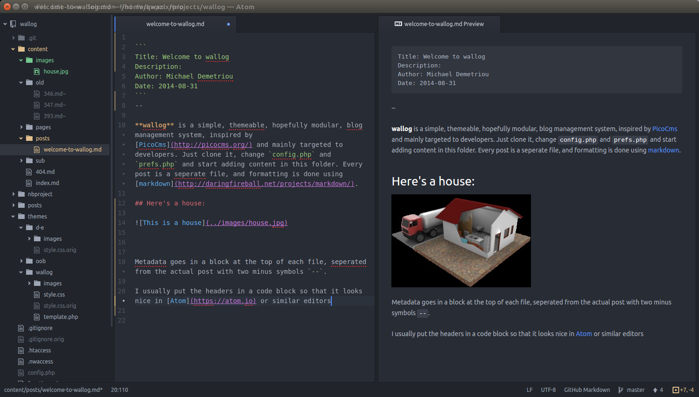

```
Title: Welcome to wallog
Description:
Author: Michael Demetriou
Date: 2014-08-31
```
--

**wallog** is a simple, themeable, hopefully modular, blog management system, inspired by [PicoCms](http://picocms.org/) and mainly targeted to developers. Just clone it, change `config.php` and `prefs.php` and start adding content in this folder. Every post is a seperate file, and formatting is done using [markdown](http://daringfireball.net/projects/markdown/).

### How to install

You will have to edit `prefs.php` and `config.php`. The configuration is split in two in order to be able to add `config.php` which is server-dependent in `.gitignore` and still be able to version the changes in preferences.

Because of this it is possible to maintain two instances of wallog in a single git repository as branches. If you keep `master` unchanged you will also be able to apply updates to your production blog(s) by merging master.

I usually init a bare repo outside `public_html` on my server and set this up as a remote. Then I create a `post_receive` hook that reads like this:

    GIT_WORK_TREE=/path/to/public_html git checkout -f

Then you just need to push `master` to that remote and your blog will be published. If you don't want to push master but another branch, you need to do this

    git symbolic-ref HEAD refs/heads/mybranch

inside the bare repo

#### Using a `docker` container

1. Build the docker image

        $ docker build --build-arg BLOG_NAME=myblog -t myblog-docker .

2. Run a container

        $ docker run -d -p 88:80 --name myblog myblog-docker

3. Visit http://localhost:88/myblog/


### How to write

Inspect this file, it's at `content/posts/welcome-to-wallog.md`. Then copy it, change the headers, edit the post and just save it.

Metadata goes in a block at the top of each file, seperated from the actual post with two minus symbols `--`.

I usually put the headers in a code block so that it looks nice in [Atom](https://atom.io) or similar editors



**Wallog** misses paging functionality for the time being.

### In action

If you want to see wallog in action go here

 * [outofbounds blog](http://oob.gr/blog)
 * [d-e technical blog](http://social.d-e.gr/)
 * If you use it, please get in touch and I can include you here if you want.

### V2

Since `b19cf6da` I changed the style of the headers in each post because the old style messed up Atom's syntax highlighting, and was frankly, stupid.

If you have an older blog you'll need to update all your posts to the new style.
